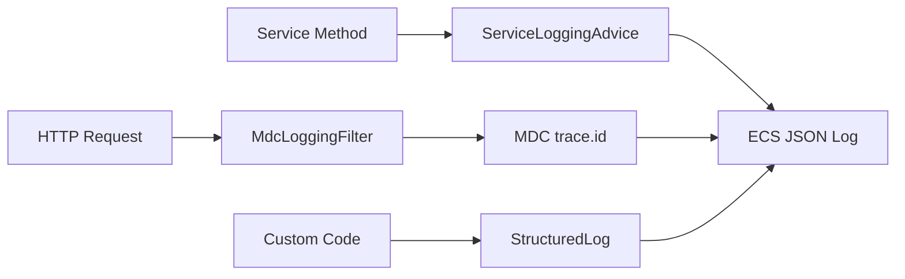

# Tutorial: Structured Logging ECS di Consumer sdk-utils

Panduan pemakaian fitur structured logging (Elastic Common Schema) untuk microservice yang depend on `com.mac:sdk-utils`.

> **Related:** [ADR-001 Structured Logging ECS](../adr/ADR-001-structured-logging-ecs.md)

---

## 1. Overview — Apa yang Didapat Consumer

Setelah menambahkan dependency `com.mac:sdk-utils`, tiga fitur logging aktif otomatis:



| Fitur | Auto? | Konfigurasi |
|-------|-------|-------------|
| Trace ID HTTP (`trace.id`) | Ya | `sdk.logging.structured.*` |
| AOP service method logging | Perlu set packages | `sdk.logging.aspect.*` |
| ECS JSON output | Ya (default) | `logging.structured.format.*` via EnvironmentPostProcessor |

---

## 2. Prasyarat

- Spring Boot **3.4.0+**
- Dependency sdk-utils di `pom.xml`:

```xml
<dependency>
    <groupId>com.mac</groupId>
    <artifactId>sdk-utils</artifactId>
    <version>1.0.0</version>
</dependency>
```

- Consumer memakai **Log4j2** (`spring-boot-starter-log4j2`) — standar saat ini

---

## 3. Setup Konfigurasi (Step-by-Step)

### Step 1 — Aktifkan AOP logging pada package service

Contoh `boilerplate/application.properties`:

```properties
spring.application.name=boilerplate

sdk.logging.aspect.enabled=true
sdk.logging.aspect.packages=com.mac.boilerplate.service,com.mac.boilerplate.repository
```

Sesuaikan package dengan struktur service Anda (pisahkan dengan koma).

### Step 2 — Structured logging (default sudah aktif)

Tidak perlu konfigurasi tambahan untuk dev — sdk-utils default:

```properties
sdk.logging.structured.enabled=true
sdk.logging.structured.format=ecs
sdk.logging.structured.auto-configure-format=true
```

Untuk **production** (`application-prod.properties`):

```properties
sdk.logging.structured.enabled=true
sdk.logging.structured.auto-configure-format=true
logging.structured.ecs.service.environment=prod
```

### Step 3 — Pastikan Log4j2 kompatibel ECS

Consumer saat ini reference `log4j2.xml` di pom tapi file sering tidak ada — Spring Boot default sudah cukup.

Jika punya custom `log4j2.xml`, **rename** ke `log4j2-spring.xml` dan gunakan:

```xml
<StructuredLogLayout format="${sys:CONSOLE_LOG_STRUCTURED_FORMAT}"
                     charset="${sys:CONSOLE_LOG_CHARSET}"/>
```

Tanpa ini, field structured tetap ter-set tapi output bisa tetap plain text.

---

## 4. Cara Pakai di Kode Application

### 4a. AOP Logging — Zero Code

Cukup konfigurasi `sdk.logging.aspect.packages`. Setiap method di package tersebut otomatis log:

**Output ECS (success):**

```json
{
  "@timestamp": "2026-05-29T12:00:00.000Z",
  "log.level": "INFO",
  "service.name": "boilerplate",
  "message": "Service method completed",
  "trace.id": "abc-123-def",
  "event.action": "evaluate",
  "event.outcome": "success",
  "event.duration": 45,
  "class": "RuleService",
  "method": "evaluate",
  "event.dataset": "boilerplate.service"
}
```

**Output ECS (failure):**

```json
{
  "message": "Service method failed",
  "event.outcome": "failure",
  "error.type": "java.lang.RuntimeException",
  "error.message": "..."
}
```

Catatan: argument method **tidak** di-log (hindari PII).

### 4b. Custom Structured Log — `StructuredLog`

Import dari sdk-utils:

```java
import com.mac.sdk_util.utils.LogFields;
import com.mac.sdk_util.utils.StructuredLog;
import java.util.Map;
import lombok.extern.slf4j.Slf4j;

@Slf4j
@Service
public class CaseService {

    public void createCase(String caseId) {
        StructuredLog.info(log, "Case created", Map.of(
                LogFields.EVENT_ACTION, "createCase",
                LogFields.EVENT_OUTCOME, LogFields.OUTCOME_SUCCESS,
                LogFields.EVENT_DATASET, LogFields.DATASET_SERVICE,
                "boilerplate.entity.id", caseId
        ));
    }

    public void handleError(String caseId, Exception ex) {
        StructuredLog.error(log, "Case creation failed", Map.of(
                LogFields.EVENT_ACTION, "createCase",
                LogFields.EVENT_OUTCOME, LogFields.OUTCOME_FAILURE,
                "boilerplate.entity.id", caseId
        ), ex);
    }
}
```

Level yang tersedia: `info`, `warn`, `error` (dengan/tanpa `Throwable`), `debug`.

### 4c. MDC untuk Kafka Listener / Background Job

HTTP filter otomatis set `trace.id` untuk REST request. Untuk Kafka/async, set manual:

```java
import com.mac.sdk_util.utils.LogFields;
import com.mac.sdk_util.utils.StructuredLog;
import java.util.Map;
import java.util.UUID;
import org.springframework.kafka.annotation.KafkaListener;
import org.springframework.kafka.support.KafkaHeaders;
import org.springframework.messaging.handler.annotation.Header;

@KafkaListener(topics = "case.created")
public void onMessage(String payload, @Header(KafkaHeaders.RECEIVED_KEY) String key) {
    StructuredLog.withMdc(Map.of(
            LogFields.TRACE_ID, key != null ? key : UUID.randomUUID().toString(),
            LogFields.EVENT_DATASET, "boilerplate.kafka"
    ), () -> processMessage(payload));
}
```

`withMdc` otomatis clear MDC setelah block selesai (termasuk saat exception).

---

## 5. Trace ID / Correlation ID

| Skenario | Perilaku |
|----------|----------|
| Client kirim header `X-Correlation-Id` | Dipakai sebagai `trace.id` |
| Header tidak ada | UUID auto-generated |
| Response | Header `X-Correlation-Id` di-echo kembali (default) |

Custom header:

```properties
sdk.logging.structured.trace-header=X-Request-Id
sdk.logging.structured.trace-response-header=true
```

**Tips:** Frontend/API gateway kirim `X-Correlation-Id` agar log bisa di-trace end-to-end di Kibana.

---

## 6. Referensi Field (`LogFields`)

| Konstanta Java | Key JSON | Nilai contoh |
|----------------|----------|--------------|
| `TRACE_ID` | `trace.id` | `abc-123` |
| `EVENT_ACTION` | `event.action` | `createCase` |
| `EVENT_OUTCOME` | `event.outcome` | `success` / `failure` |
| `EVENT_DURATION` | `event.duration` | `45` (ms) |
| `EVENT_DATASET` | `event.dataset` | `boilerplate.service` |
| `CLASS` | `class` | `CaseService` |
| `METHOD` | `method` | `createCase` |
| `LAYER` | `layer` | `service` |

Field custom: gunakan prefix `sdk.` (contoh: `sdk.entity.id`, `sdk.rule.id`).

---

## 7. Konfigurasi Lengkap

```properties
# --- AOP service logging ---
sdk.logging.aspect.enabled=true
sdk.logging.aspect.packages=com.mac.my_service.api.services,com.mac.my_service.kafka.listeners

# --- Structured logging ECS ---
sdk.logging.structured.enabled=true
sdk.logging.structured.format=ecs
sdk.logging.structured.auto-configure-format=true
sdk.logging.structured.trace-header=X-Correlation-Id
sdk.logging.structured.trace-response-header=true
sdk.logging.structured.filter.enabled=true
sdk.logging.structured.filter.order=-100

# --- Spring Boot ECS (auto-set oleh sdk-utils, bisa override) ---
logging.structured.format.console=ecs
logging.structured.format.file=ecs
logging.structured.ecs.service.environment=${spring.profiles.active:default}
```

---

## 8. Profil Dev vs Prod

| Setting | Dev | Prod |
|---------|-----|------|
| ECS JSON console | Opsional (plain text OK) | Wajib |
| `sdk.logging.structured.enabled` | `true` | `true` |
| `auto-configure-format` | `false` (readable logs) | `true` |
| Log level | `DEBUG` | `INFO` / env var |

Contoh dev — matikan JSON, tetap structured fields di plain text:

```properties
sdk.logging.structured.auto-configure-format=false
logging.level.com.mac=DEBUG
```

---

## 9. Troubleshooting

| Gejala | Penyebab | Solusi |
|--------|----------|--------|
| Log masih plain text di prod | Custom `log4j2.xml` bypass Spring Boot | Migrasi ke `log4j2-spring.xml` + `StructuredLogLayout` |
| Tidak ada AOP log | `sdk.logging.aspect.packages` kosong | Set package service/listener |
| `trace.id` null di Kafka | Bukan HTTP request | Pakai `StructuredLog.withMdc()` |
| Log lama format `ClassName:Function:...` | `sdk.logging.structured.enabled=false` | Set ke `true` |
| Field ECS tidak muncul | SLF4J binding lama | Pastikan Spring Boot 3.4 + Log4j2 starter |

---

## 10. Checklist Migrasi Consumer

- [ ] Update dependency sdk-utils ke versi terbaru
- [ ] Set `sdk.logging.aspect.packages` ke package service/listener
- [ ] Verifikasi Log4j2 config kompatibel ECS
- [ ] Tambah config prod: `sdk.logging.structured.auto-configure-format=true`
- [ ] (Opsional) Ganti `log.info(...)` penting dengan `StructuredLog`
- [ ] (Opsional) Set `withMdc` di Kafka listener
- [ ] Test: kirim request dengan header `X-Correlation-Id`, cek JSON log di console/Kibana
